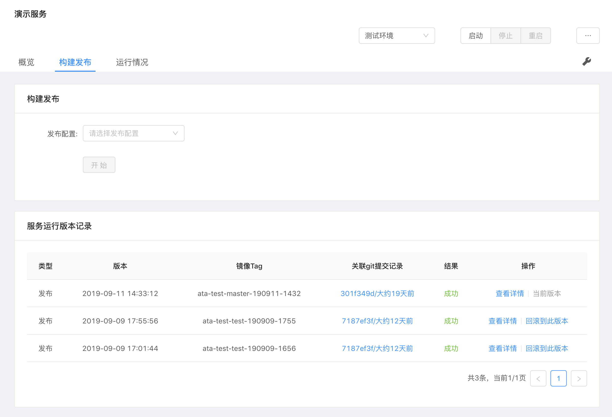
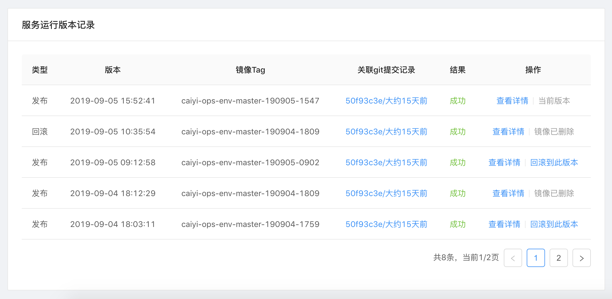

## 服务发布

### 发布

构建发布流程示例

- 构建发布  
选择一个构建发布配置后，再选择要发布但代码分支，点击"开始"按钮即可开始发布。

- 镜像发布  
类似于构建发布，选择镜像发布配置后再选择一个镜像即可开始发布。

### 回滚

在服务运行版本记录列表中，可选择发布成功并且该镜像没有被删除但记录进行回滚操作。

### 扩缩容

服务发布成功后，对于正在运行的服务可进行动态扩缩容，调整资源和实例。