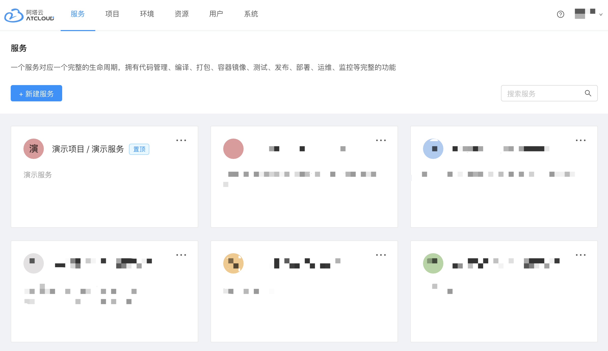
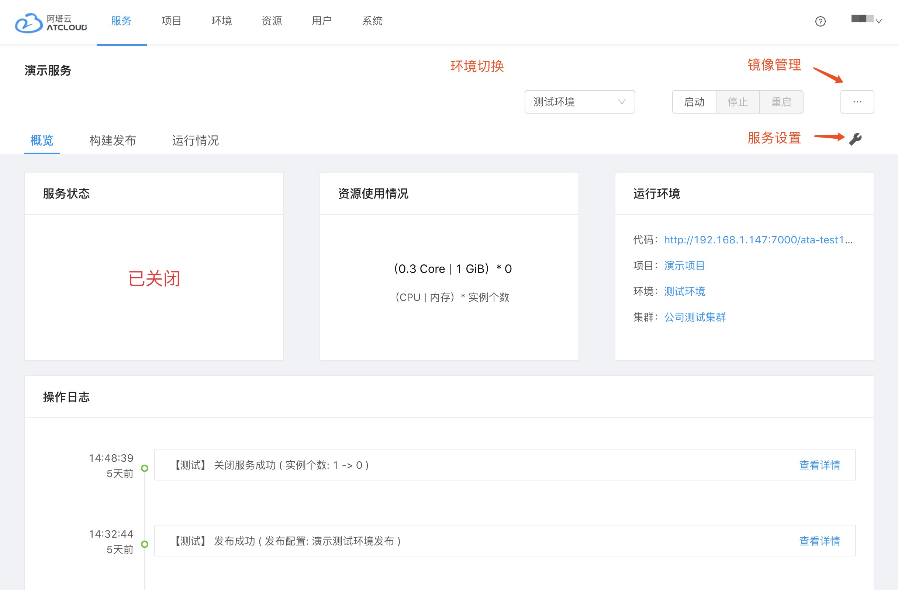
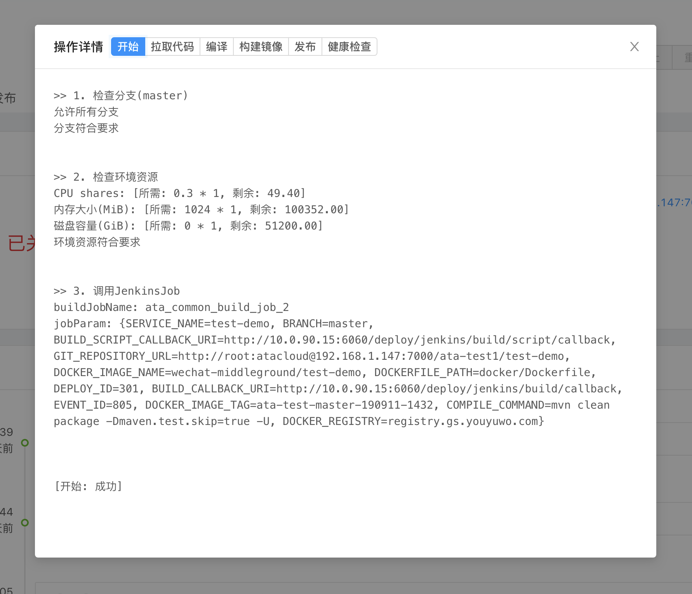
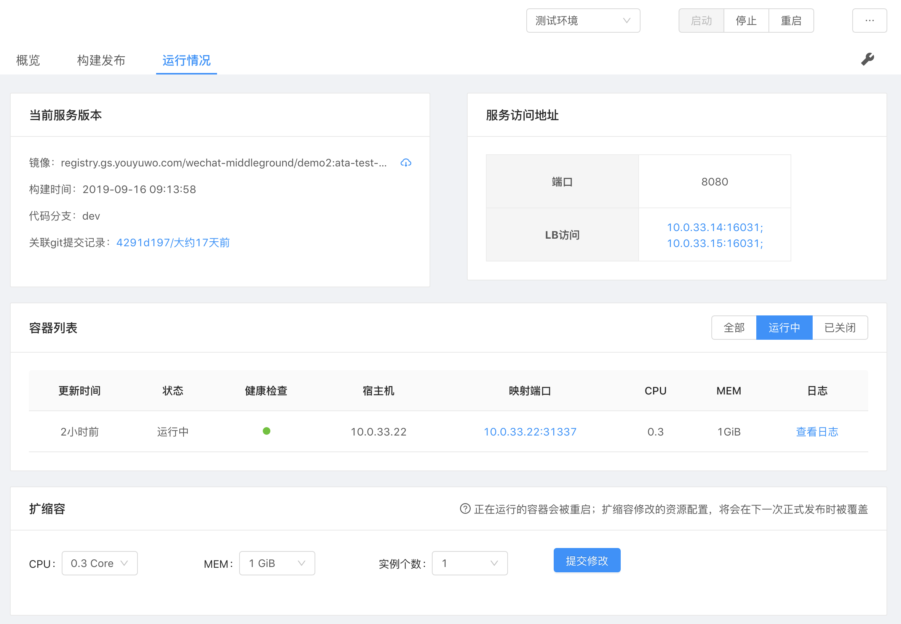

## 服务

### 1.服务列表

- **排序：** 服务列表的卡片先按照项目排序，同一个项目里的服务再根据名称排序。
- **置顶：** 用户可以自行对服务进行置顶操作，仅对自己有效。
- **搜索：** 服务列表可输入关键字进行过滤，会匹配服务名称、服务CODE和服务描述。

### 2.服务详情的导航栏

服务的导航栏分别为：概览、构建发布、运行情况、服务环境、服务快捷操作、镜像管理、服务设置。

### 3.环境切换

除服务的基本信息外，其他信息都与具体环境有关，所以相关数据功能都按照当前所选环境进行展示和操作！

### 4.服务概览

- **运行状态：** 服务当前环境的运行状态。
- **资源使用：** 服务当前环境使用的资源。
- **运行环境：** 服务的代码库地址、所属项目、环境、集群信息。
- **操作日志：** 记录了服务在当前环境所有的操作记录级相关日志，如下图是进行了一次发布操作的日志：

### 5.服务发布

跳转到[使用手册·服务发布](./app_deploy.md)

### 6.服务运行情况

- **当前版本：** 服务所使用的镜像版本信息（镜像构建时间，代码提交记录等）。 
- **访问地址：** 服务的访问地址信息。
- **容器列表：** 服务运行的具体容器实例信息（包括容器日志查看）。
- **扩缩容：** 动态调整服务的cup、内存以及实例个数。

### 7.服务设置

- **基本信息：** 可修改服务负责人、服务描述信息，服务类型不可变更。
- **发布配置：** 可见[使用手册·新建服务发布配置](./app_deploy_config_create.md)
- **服务删除：** 删除操作不可逆，且是针对当前服务，而不仅是服务的当前环境。