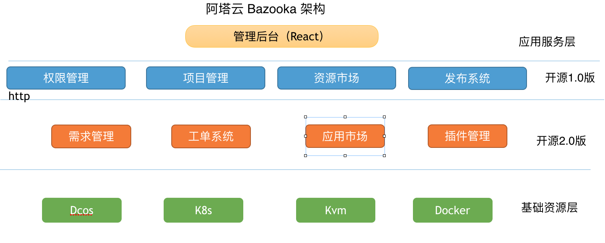
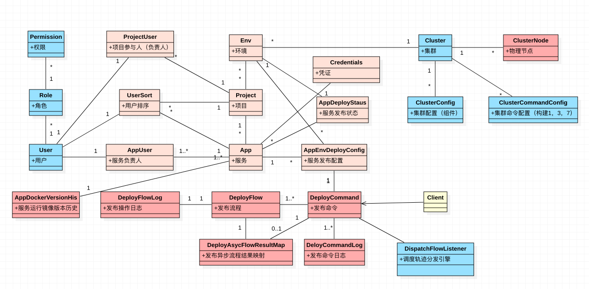
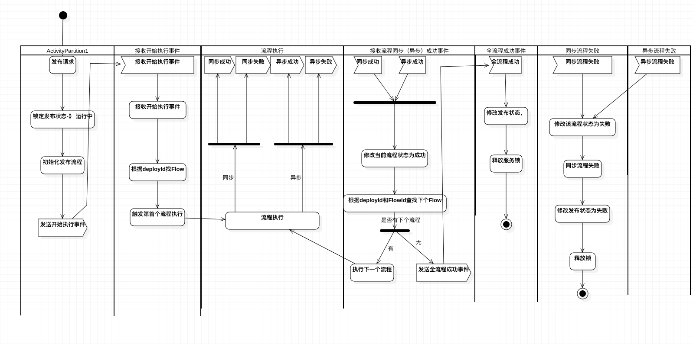
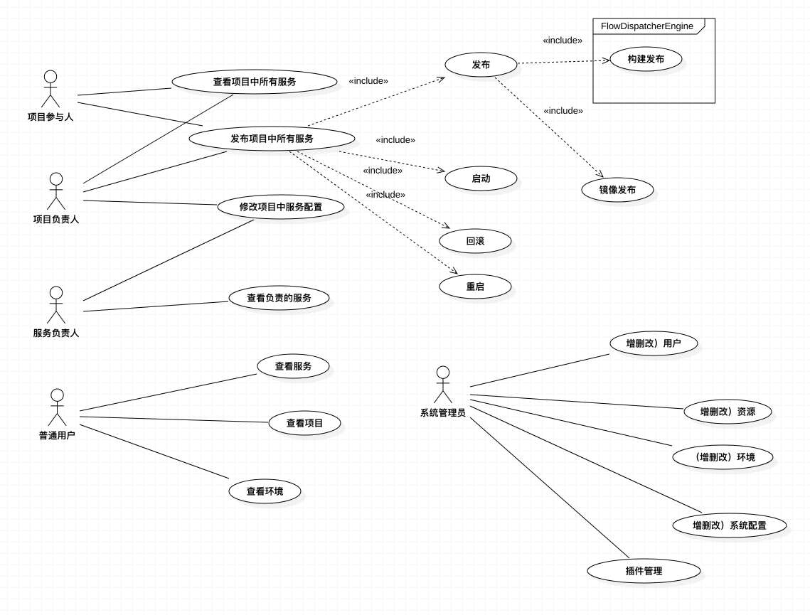

Bazooka 从本质上解决的问题如下： 
1（权限管理）：谁，在企业中是什么角色，有哪些功能权限  
2（项目管理）：他能管理哪些服务，这些服务属于哪些项目（产品线）， 项目能布到哪些环境（测试，预发，生产）， 这些环境在哪个集群（上海线上机房K8s集群， 苏州线上机房） 
3（发布系统）：从外部接收指令，解决 能否执行，如何执行的问题，执行的成功失败 如何处理 
4（需求管理）：这个服务为什么存在， 为什么要进行这次发布， 这次发布解决了哪些问题 
5（工单系统）：解决一个流程 的多个节点 的权限 审批问题 
6（应用市场）：功能共享和复用，快速发布中间件  
7（插件管理）：功能扩展 

# 领域模型设计
#### [领域模型图]

#### [发布流程图]

#### [发布状态机]

#### [发布活动图]

#### [用例图]

