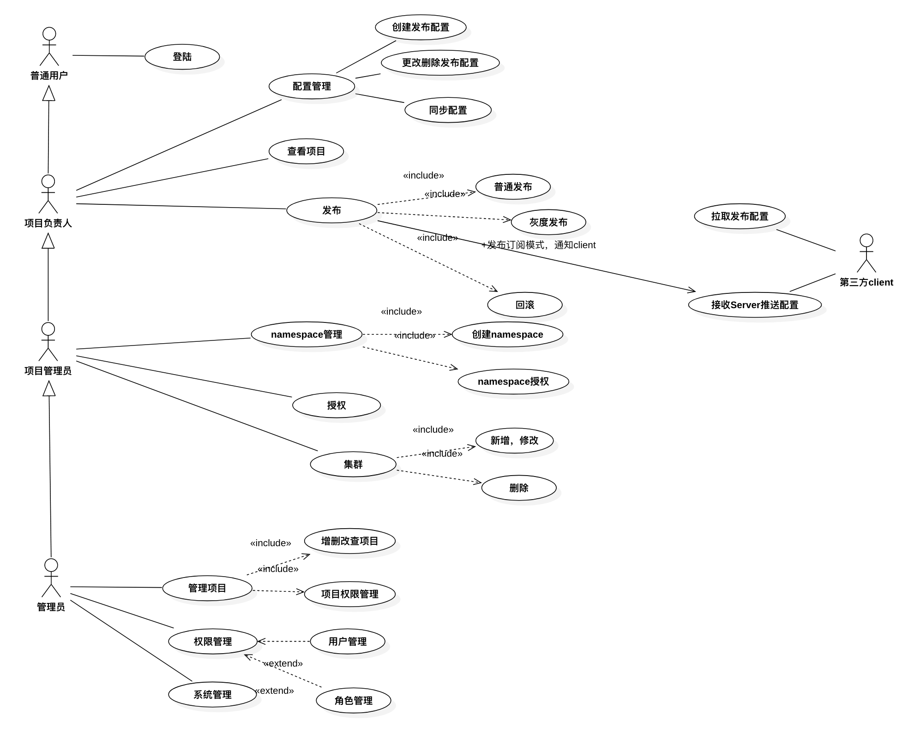
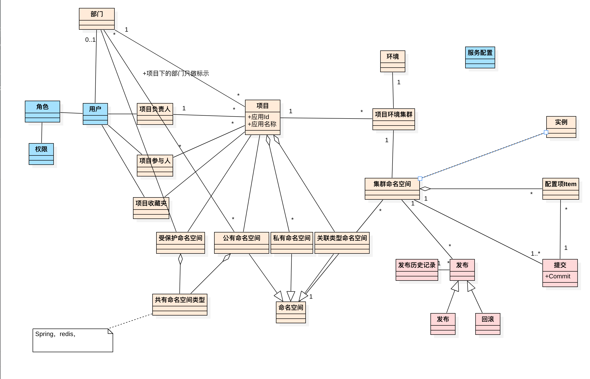
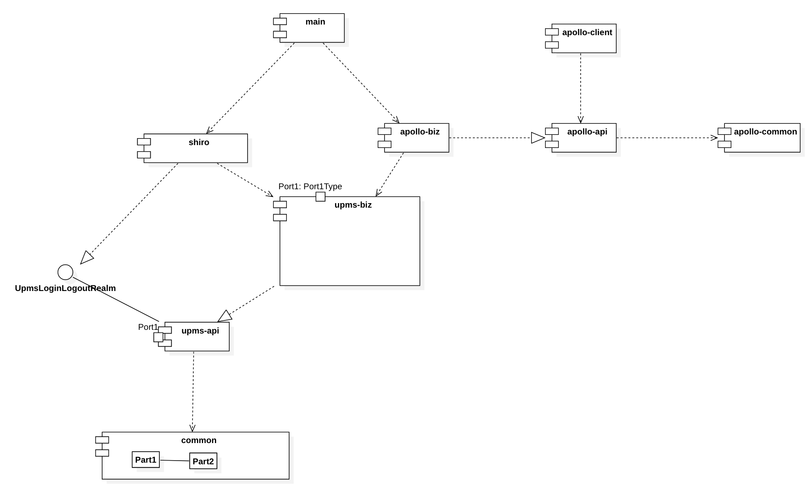

# 领域模型设计

## [用例图]

### CS的客户端交互逻辑设计

## [领域模型图]

###权限管理的设计（参考git的的权限设计方案）
用户的权限 = 用户所在部门权限 + 用户角色权限 + 用户在项目中的角色（项目负责人，或者项目参与人）

#### 用户的数据权限(能看到哪些项目) =  用户所在部门权限 + 用户在项目中的角色（项目负责人，或者项目参与人）
#### 用户的菜单按钮权限 = 用户在项目中的角色（项目负责人，或者项目参与人） + 用户的角色（是否系统管理员）
## [模块依赖]

